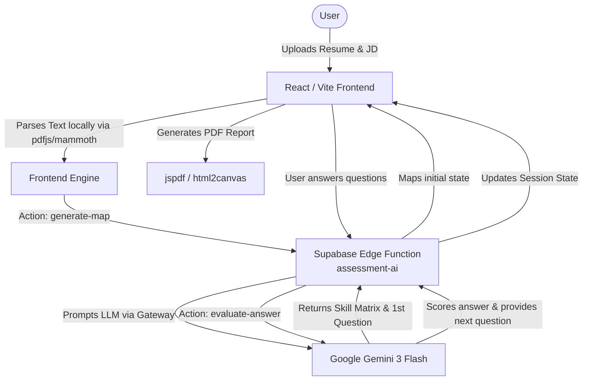

# Insight Journey Plan

**Insight Journey Plan** is an AI-powered skill assessment and learning path generator. By analyzing a user's resume against a target role or job description, the platform maps existing skills, identifies gaps through an interactive assessment chat, and generates a personalized learning plan. 

## ✨ Features

- **📄 Resume Parsing:** Extracts and analyzes text from uploaded resumes (supports PDF and Word documents).
- **🎯 Skill Mapping:** Intelligently maps the user's current experience against the prerequisites of a target role or specific job description.
- **💬 Interactive Assessment:** An AI-driven chat interface that asks targeted questions to validate skills and accurately determine proficiency levels.
- **📊 Skill Matrix & Gap Analysis:** Visualizes the user's current competencies versus the required skills for their desired role.
- **📈 Learning Plan Generation:** Creates a structured, actionable learning journey based on identified skill gaps.
- **📥 PDF Export:** Generates and exports the final assessment report and learning plan as a stylized PDF.

## 🛠️ Tech Stack

- **Frontend Framework:** React 18, TypeScript, Vite
- **Styling:** Tailwind CSS, [shadcn/ui](https://ui.shadcn.com/) (Radix UI primitives)
- **Backend & AI:** Supabase (Database, Auth, and Edge Functions for AI processing)
- **Document Processing:** `pdfjs-dist` (PDFs), `mammoth` (Word documents)
- **Exporting:** `html2canvas`, `jspdf`
- **Package Manager:** Bun

## 📂 Project Structure

```text
insight-journey-plan-main/
├── public/                 # Static assets
├── src/
│   ├── components/         # React components (Assessment, UI elements, etc.)
│   ├── data/               # Static/mock data and definitions
│   ├── hooks/              # Custom React hooks (e.g., useAssessmentMachine)
│   ├── integrations/       # API clients (Supabase client and types)
│   ├── lib/                # Utility functions and API wrappers
│   ├── pages/              # Main application views and routing (Index, NotFound)
│   ├── test/               # Vitest testing setup and files
│   └── types/              # TypeScript type definitions
├── supabase/
│   ├── functions/          # Deno-based Edge Functions (assessment-ai)
│   └── config.toml         # Supabase local configuration
├── vite.config.ts          # Vite configuration
└── package.json            # Project dependencies and scripts
```

## 🧠 Architecture & Scoring Logic

### Architecture Diagram

The application leverages a modern React frontend linked to a Serverless AI backend (Supabase Edge Functions) to perform real-time assessment and mapping.



### Assessment Logic & Scoring

The assessment workflow relies on a multi-stage process where initial heuristics and AI evaluations combine:

1. **Initial Extraction (Frontend)**
   - Text parsing tools extract content from the Resume (PDF/Word/TXT).
   - A local heuristic function detects candidate skills by matching text against known aliases and filtering stop-words. 
   - It calculates initial "Resume Years" using regex heuristics (e.g., `X years experience with Y`) and grabs sentence snippets for context.

2. **Skill Mapping (AI Backend)**
   - The frontend sends the structured extracted data (Resume terms + Job Description text) to the `generate-map` action.
   - The LLM determines the `jdWeight`, `jdRequiredLevel` and categorizes the skill into one of four buckets: `matchedStrong`, `matchedWeak`, `gap`, or `bonus`.
   - The AI identifies the most critical gaps/weaknesses and generates the very first targeted interview question tailored to the user's declared level.

3. **Evaluation Loop (AI Backend)**
   - Upon submitting an answer, the `evaluate-answer` action queries the LLM again.
   - **Scoring**: The LLM evaluates the user's answer against a rubric, generating a score (1-10). It evaluates strengths, identifies gaps, and decides if a follow-up question is necessary or if it should move on to the next skill.
   - The session maintains a state machine (handled via `useAssessmentMachine` hook) that progresses through prioritized skills.

4. **Final Summary & Learning Plan**
   - Once all prioritized skills are evaluated, the LLM outputs a final array of summaries containing the `assessedLevel`, `gapSeverity`, and `confidence`. 
   - If the session finishes, a structured Learning Plan (roadmaps and priorities) is built to help the user bridge the gap between their `assessedLevel` and the `jdRequiredLevel`.

## 🚀 Getting Started

### Prerequisites

Ensure you have [Bun](https://bun.sh/) and [Node.js](https://nodejs.org/) installed on your machine.
You will also need a [Supabase](https://supabase.com/) project to utilize the Edge Functions and database integrations.

### Installation

1. Clone the repository and navigate to the project folder:
   ```bash
   cd insight-journey-plan-main
   ```

2. Install dependencies using Bun:
   ```bash
   bun install
   ```
   *(Alternatively, you can use npm install or pnpm install)*

3. Set up your environment variables based on your Supabase project (you'll need the Supabase URL and Anon Key).

### Running Locally

To start the Vite development server:

```bash
bun dev
```

### Building for Production

To build the application for production:

```bash
bun run build
```

To preview the production build locally:

```bash
bun run preview
```

## 🧪 Testing

This project uses [Vitest](https://vitest.dev/) for unit testing. 

- Run tests: `bun run test`
- Run tests in watch mode: `bun run test:watch`

## 📡 Backend Development (Supabase)

The intelligent assessment engine operates via Supabase Edge Functions (`supabase/functions/assessment-ai/index.ts`). To work on the backend logic locally, ensure you have the [Supabase CLI](https://supabase.com/docs/guides/cli) installed and linked to your project.
